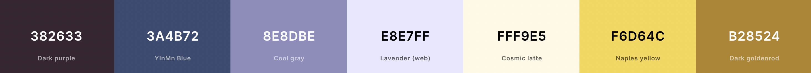
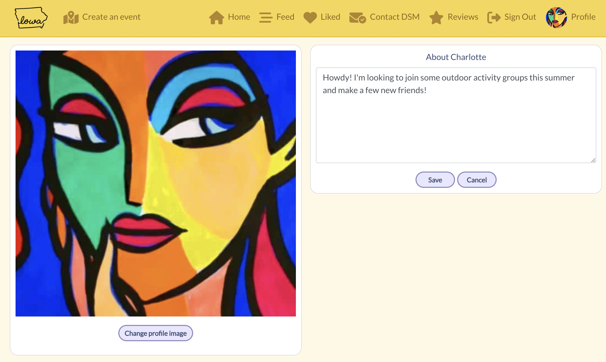

# **Iowa Summer Activities**

The Iowa Summer Activities website was created to be a hub of information for people in the Des Moines (Iowa) area to checkout all types of summer activities. The city itself generally has a good handle on diseminating information about specific events but I wanted to incorporate general venues and activities into this sight that may not have a specific event date or time.

As such, visitors and residents alike can enjoy the number of activities and outdoor events that Des Moines has to offer, whether they're life-long Iowans or just visiting for a few days. This website will hopefully enable neighbors to connect with each other through similar interests while enjoying the hustle and bustle (or tranquility, depending on the activity) of the city in Summer.

Through the platform, registered, logged-in users can create events and upload information about them. Users can also create a profile and like and comment on others' posts, leave a review of an event and follow other users.

Though it could have a place in a real-world setting, this website was created for Portfolio Project 5 (Advanced Front End) as part of the Diploma in Full Stack Software Development program through [Code Institute](https://www.codeinstitute.net). Iowa Summer Activities is ficticious and does not provide veritable information for events happening in Iowa.

Take a look at the live website [here](https://activities-frontend-6f71eff2ee1a.herokuapp.com/).

# [Table of Contents](#table-of-contents)
- [**Project**](#project)
  - [Objective](#objective)
  - [Site User's Goal](#site-users-goal)
  - [Site Owner's Goal](#site-owners-goal)
  - [Project Management](#project-management)
- [**User Experience (UX)**](#user-experience-ux)
  - [Wireframes](#wireframes)
  - [User Stories](#user-stories)
  - [Site Structure](#site-structure)
  - [Design Choices](#design-choices)
- [**Existing Features**](#existing-features)
  - [Authentication](#authentication)
  - [Homepage](#homepage)
  - [Create an Event](#create-an-event)
  - [Feed](#feed)
  - [Liked](#liked)
  - [Contact](#contact)
  - [Reviews](#reviews)
  - [Profile Page](#profile-page)
- [**Future Implementations**](#future-implementations)
- [**Technologies Used**](#technologies-used)
  - [Languages](#languages)
  - [Frameworks & Software](#frameworks--software)
  - [Libraries](#libraries)
- [Testing](#testing)
- [Deployment](#deployment)
- [Credits](#credits)
- [Acknowledgements](#acknowledgements)
<!-- ## Table of Contents

- [Project](<#project>)
    * [Objective](<#objective>)
    * [Site Users Goal](<#site-users-goal>)
    * [Site Owners Goal](<#site-owners-goal>)
    * [Project Management](<#project-management>)

- [User Experience (UX)](<#user-experience-ux>)
    * [Wireframes](<#wireframes>)
    * [User Stories](<#user-stories>)
    * [Site Structure](<#site-structure>)
    * [Design Choices](<#design-choices>)

- [Existing Features](#features)
  * [Navigation](#navigation)
  * [Authentication](#authentication)
  * [Homepage](#homepage)
  * [Create an Event](#create-an-event)
  * [Event Detail Page](#event-detail-page)
  * [Feed](#feed)
  * [Liked](#liked)
  * [Contact DSM](#contact)
  * [Reviews](#reviews)
  * [Profile Page](#profile-page)
  * [Reusable React Components](#reusable-react-components)

- [Features Left To Implement](<#features-left-to-implement>)

- [Technologies Used](<#technologies-used>)
    * [Languages](<#languages>)
    * [Frameworks & Software](<#frameworks--software>)
    * [Libraries](<#libraries>)
- [Agile Workflow](#agile-workflow)
  * [Github Project Board](#github-project-board)
- [Testing](#testing)
- [Deployment](#deployment)
- [Credits](#credits) -->

# **Project**

## Objective

The objective of this project was to create a web application where people can share information about activities and events happening in the Des Moines, Iowa area. The application could also serve as a way to meet new people within the community, while participating in local events.

Given the various attractions Iowa has to offer, this application not only enables neighbors to participate in specific events, they can also glean information on state parks and other sites of interest that aren't happening at a specific time. Through this platform, users can view a list of events, create their own, edit or delete it and comment on and review other posts. Users can also filter the content through keyword or post author and follow other users.

## Site User's Goal

People using this application are generally either interested in gaining information about events happening in the area or wanting to post information about an activity. As previously mentioned, however, users will also be able to find non-specific activities like campsite, state parks, nature reserves, etc. This is a platform that can include any type of activity, whether it's a specific planned event or just something 'fun' to check out in Des Moines or in Iowa. 

Once users participate in an activity or travel to a place, they leave a review comment and 0-5 star review. Users can also leave comments on posts for activities and events, 'like' (and 'unlike') activities and follow users they're interested in. Users are unable to review activities, like or leave comments on posts for which they are the author.

## Site Owner's Goal

As the site owner, I was originally interested in a platform I could share with my immediate family for a foreign visitor coming to Iowa this summer. Some in our family aren't on social media, which is the main way people find out about activities and events happening in our community. I wanted to have a list of activities, restaurants, state parks, ice cream parlors, etc as a trove of information so our visitor would be able to take advantage of her time in the state of Iowa as much as possible. 

Once starting the development process of this application, I realized that this platform could be beneficial to users outside my family for the same reasons. As such, I encourage all members of our community to visit the website, attend some of the activities and post their own. Through following other users and interacting with others on the site itself, neighbors can become friends and our small community can continue to grow.

[Back to top](<#table-of-contents>)

## Project Management

### GitHub Project Board

Before starting the frontend of this project, I thought about EPICs and user stories I wanted to include for a good user experience for visitors to this platform. I started by reviewing what I'd created for the [backend project board](https://github.com/users/Kaylaesmith1/projects/3/views/1) for the backend API, which included various user stories for each app created. Since most features were already covered from the backend, I focused my EPICs on then avigation bar and homepage, adding a couple user stories to EPICs for three apps: Following, Profiles, and Comments. 

Similarly, on the frontend project board, each user story belongs to an EPIC and I prioritized them using the MoSCoW method.

[Back to top](<#table-of-contents>)

# **User Experience (UX)**

## Wireframes

The wireframes for the project were created using [Figma](https://www.figma.com/). Wireframes have been created and included for both desktop and mobile devices. The application itself is responsive for desktop, tablet and mobile-sized devices. 

The layout closely follows the Moments walkthrough project, including a navigation bar with registration and login features, the activities section in the middle as posted events and on the right, on a desktop device, a list of most followed profiles. On smaller devices, the navbar becomes a hamburger menu, the most follow profiles move to the top of the page and the events are underneath. This layout was chosen for ease and because the information translates well through various device sizes. I found this layout easy to navigate from my desktop, laptop and mobile.

<b>Wireframes</b>

 

## User Stories
Like with the backend, I used the Kanban project board in GitHub to help guide me through the user stories for the frontend application. creating this API. I used Agile principles again to create 5 EPICs and their subsequent user stories, where each user story belongs to one EPIC. Since most user stories dealing with my 7 separate apps in this project were discussed in the backend README documentation, I'll cover new EPICs here along with their user stories.

### EPIC | NavBar
As the developer I can create a functional navigation bar at the top of my page so that users can easily look at different pages of the site.

#### User Stories
- As a user I can click each navbar icon so that I am redirected to different pages.
- As a user I can upload a profile picture so that other users can see who my account belongs to.

### EPIC | Homepage
As the developer I can create a homepage where users can log in / register and see site information so that they know of events occurring.

#### User Stories
- As a user I can create an account so that I can create and view events and see other users' profiles.
- As a user I can log into my account so that I can interact fully with the website.
- As a logged in user I can see a list of events so that I can decide if I'm interested and/or want to attend.
- As a logged in user I can click a specific event so that I can see the details of that event.
- As a logged in user I can click the 'create event' button so that I can create an event and add information about it for others to see.
- As a logged in user I can use the search bar so that I can search for events by keyword.
- As a logged in user I can view the 'popular profiles' section so that I can see profiles of other users and choose to follow them.

### EPIC | Profile
As the developer I can create a Profile section so that users can update personal information and images.

#### User Stories
- As a user I can upload a picture so that other users can see who I am via my profile.
- As a user I can view others' profiles so that I can see their posts and profile details.
- As a user I can edit my own profile so that the information always remains updated and correct.
- As a user I can change my username and password so that these credentials are updated in case of a security issue.

### EPIC | Comments
As the developer I can create a Comments section so that users can comment on posts and interact with others on the site

#### User Stories
- As a user I can comment on an event so that others will know my opinion.
- As a user I can view other comments on an event so that I can see others' opinions on that event.
- As a user I can edit my own comments so that information is corrected.
- As a user I can delete my own comments so that any erroneous information from a comment is not on the site.

### EPIC | Following
As the developer I can create a followers section so that registered, logged in users can follow and unfollow other users.

#### User Stories
- As a user I can follow another registered user so that I can view their profile on my feed page.
- As a user I can unfollow another registered user so that their profile information will no longer be visible on my feed page.
- As the developer I can create follow / unfollow buttons so that registered, logged in users can follow and unfollow other users.

[Back to top](<#table-of-contents>)

## Site Structure

 The Iowa Summer Activities website is interactive, both for non registered, non logged-in users and for users signed into their account. Depending on the login status, some pages may not be visible to the user. When a user is not logged into their account, they see the home page, the sign in page and the sign up page in the navigation bar. . Onces logged in
  is split up in two parts: when the user is logged out and when the user is logged in. Depending on login status different pages are available for the user. When the user is logged out the pages: Home, and Sign In or Up are available from the Navigation Bar menu. When the user is logged in Feed, My Events, Reviews, Signout and Profile Page also become available.

## Design Choices

* ### Color Scheme

When choosing a color palette for this application, I wanted something bright and summery but that had contrasting tones for text. I wanted to have a lighter backgroud color but still have the navitation bar and post sections stand out so as not to take away from the actual content of the site. 

Though seven colors can seem excessive, the darker colors are only used for some of the text and various icons, while the lighter tones are used for buttons and the rest of the overall layout of the page.

* ### Typography

The main fonts used on this site are 'Montserrat' and 'Lato', both with a fallback font of Sans-Serif, should the page not load properly. These fonts are both clear and have good letter spacing on their own, which make them easy to read for most users.

[Back to top](<#table-of-contents>)

# **Existing Features**

* ## Navigation

The navigation bar is straight forward and easy to interact with. Depending on the user's log-in status, different icons for different pages are visible. When navigating from a tablet or mobile device, the full navigation bar becomes a hamburger dropdown menu with the site icon to the far left.

For first time users and for those who are logged out of their account, the following menu is visible:

* Iowa Summer Activities Logo - On the far left hand side of the navigation bar users can see the Iowa Summer Activities logo. This logo is identical to the browser tab favicon for easy brand recognition and is visible on all pages of the site. Clicking the logo will return the user to the homepage.
* Homepage - The first menu icon and the landing page of the site is the homepage. Here, the user can see all activities, their descriptions and view any comments. At the top, there is a search field where users can search an activity by keyword or author, while on the right-hand side, there is a section of most followed profiles.
* Authentication - Users can either sign up for an account or sign into their existing one. Clicking either of these icons will take users to the corresponding page.

Once logged in, the user will see additional icons and be able to navigate to those pages. Those include:

* Create an Event - On this page the user can create a post for an activity. They're asked to enter in a title, a brief description and to upload an image. Both the image and title fields are obligatory.
* Feed - Here users can see a list of activities. To the right, they have a section of 'most followed profiles' and just under the navigation bar, a search bar is visible where users can search by keyword or by author.
* Liked - This page shows all events or activities the logged-in users has 'liked'. Clicking again on the heart icon will 'unlike' the activity and it will be removed from this page upon refresh. 
* Contact DSM - Users can contact the Des Moines city officials in charge of this website and who have an eye on the activities posted. Given that this site has been developed for learning purposes only, the contact messages go to the backend API database and not to a real city official. 
* Reviews - Users can review any activity for which they are not the author. They can leave a review message and a star review of 0-5 stars as well as reading other users' review posts. Users are unable to review an event they posted and users can not review an activity more than once.
* Authentication - The only icon that appears for logged-in usres is the 'sign out' icon, which will log the user out if clicked and return them to the homepage.
* Profile - This is the user's own profile that will show their avatar image if they uploaded one. If not, a default avatar image will be displayed. Clicking the avatar will bring them to their profile page where they can see all activities they posted and update their profile. Users can change their username or password and edit their profile, updating the avatar image and their bio information.

[Back to top](<#table-of-contents>)

## Authentication

New visitors to the site or those who didn't previously create an account can click the sign up icon in the navbar to be taken to the sign up page and create an account. They'll be asked to enter in a username, password and confirm the password. I followed the standard dj-rest/auth/registration user account signup that was used in the Moments walkthrough project to implement this feature in my application.

If a user already has an account, they can click the 'sign in' icon in the navigation bar, enter their credentials and access their account.

Once signed in, if the user wants to sign out, they click the 'sign out' icon in the navigation bar that will become visible if they're logged into their account.

## Homepage

The main components of the homepage are:

1. Search bar
2. Posted activities
3. Most followed profiles

### Search Bar

The user can enter a keyword or the author of a post into the search bar, which will then return the corresponding activities. 

### Posted Activities

Activities created through the Iowa Summer Activities platform are all displayed on the homepage, ordered by created date in descending order. Each post displays an image, title, short description of the activity (optional), the author, the date created and the likes and comments for the specific post. This information is also stored in the backend API and accessible from there. Clicking the image or the comments bubble icon will take the user to the event details page where they can leave a comment if they choose.

[Back to top](<#table-of-contents>)

### Most Followed Profiles

The most followed profiles component is visible throughout the website, regardless of login status. If users are logged in, they're able to follow or unfollow other users, via buttons next to the person's profile avatar and username on desktop or laptop devices. Users are unable follow themselves as no button appears next to their avatar. This feature filters users by follower count, from highest to lowest, which is the order the avatar will appear in the list. Clicking the profile avatar will allow you to view that user's full profile.

The layout changes slightly in the mobile version as the section appears at the top of the page under the navigation bar rather than on the right-hand side of the page. Four profiles are shown in the tablet and mobile versions, rather than six in the desktop version and users on tablet or mobile devices have to click the person's avatar to follow them as the buttons are only visible in the desktop version. 

## Create an Event

If the user is logged in, they can create a post for an activity to share on the platform. Clicking the 'Create an Event' button in the navigation bar will take them to a new event page where they can enter the title of the event, a brief description (optional) and an image for the event. Saving this form will post this information to the API and will show up on the frontend homepage. Once the activity is posted successfully, the user is returned to the homepage where that event is the first seen.

### Event Details Page

Users can see the details of any event by clicking the event image. They'll be taken to the specific page for that event where they can view and leave comments and like the activity.  

If you created the event, you can also edit it from this page by clicking the dropdown arrow next to the date and select the pencil icon to edit the post. This will take you to the creation form that will now have pre-populated fields with the existing information. The user can change what they want (title, description, image), save and the information will be updated, both in the API and on the frontend website. 

If the creator of an event chooses to delete the event, the process is similar in that they will choose the trashcan icon from the dropdown arrow menu on the event's detail page. This action will remove the event from the API and from the frontend and is irreversible.

Under the details of the event itself, there's a comment section that will show other users' comments, if there are any. If not, a message will be displayed.

Logged out or unregistered users can view comments though they won't be able to leave one until they log in. If there are no comments, a similar message will be displayed but the user will not be prompted to leave a comment. They can only do this when they've logged in.

All comments posted about an event will be visible to all users, regardless of login status.  comments that have been posted about this event are displayed, regardless of login status. If the user logs in they will see a comment form above the existing comments where they can post their own comment or question about the activity.

[Back to top](<#table-of-contents>)

## Feed

Aesthetically, the feed page is the same as the homepage in the sense that it displays a list of events, the seach bar and the most followed profiles section. The difference here is the feed section only shows events posted by users you follow and therefore, to see this page at all, the user needs to be logged in. If you're not following anyone, a 'no-results' image and message will appear. 

## Liked

The 'Liked' page shows a list of events a logged-in user has 'liked'. On this page, if the user clicks the heart icon again to 'unlike' that activity, the count will go down by one and, upon refresh, that event will no longer be visible on that user's liked page.

## Contact

Logged in users can contact the DSM Official account for questions about activities and other correspondence. Clicking the Contact DSM icon in the navigation bar will bring the user to a form they can fill out and submit. 

All fields are mandatory and error messages will appear if one is left blank or if the email field is invalid. 

Since this website is for learning purposes only, the contact message will go to the backend database and not an actual email account. Once the form is sent, a 'Thank you' message will be displayed to the user and they can then continue navigating the website.

## Reviews

Only logged in users can access the reviews page. The page layout is similar to the Feed, Liked and Homepage with the navigation bar at the top with a search bar under it and the Most Followed Profiles section to the right, on desktop. The reviews section itself shows all of the activities posted and the user can click to create their own review comment (mandatory) and a star rating (0-5).

Each activity to review includes the avatar of the user who posted the event, the title of the activity, the average rating in stars and the review count. At the far right, a 'post a review' button is shown where the user can review the event.   

If the user hovers over the review count number, a message will pop up telling them to click to read the reviews. Doing this will open the review comments component and the user will be able to read others' reviews.

Each activity follows this structure, which includes a button to post a review. However, owners cannot review their own activity. A tooltip message will be shown if a user tries to do this.

Lastly, users can only review an event one time, though they can edit their review message. To change the star rating, the user will have to delete their review and start again.

[Back to top](<#table-of-contents>)

## Profile Page

Clicking on the avatar image of any user will take you to the profile page for that user. There you will see the option to follow / unfollow them, how many posts they've created, followers they have, how many other users they're following and the events they've posted.

If you click your own avatar, you'll be taken to your own profile page where you will see events you've created and the option to edit your profile.

Clicking the pencil icon will let you select one of three option: edit profile, change username or change password. Choosing to edit your profile will take you to a page where you can change your bio information or avatar image. 

# **Future Implementations**

**Back To Top Scroll component** 

I have the infinite scroll component implemented on this website, meaning the page can get pretty long if there are a lot of activities posted. I thought about including  a 'back to top' button once the user had scrolled down 1000px and had this button created and working during the process. However, upon testing at the end of the project, I noticed errors arising at various times, depending on whether a user was logged in or not, though these errors weren't always habitual. Given that this feature is not necessary for the application to work properly, I ultimately deleted it from production. In future versions of the website, it would be a nice feature to include to improve the UX.

**Date / Time Component** 

Incorporate the ability for people to post their activity and include the date and time it's happening. This would enable the community to actively participate in events around town.

**Map**

Include Google Maps or some other mapping or GPS component to show the exact location of the event. This would enable attendees to enter in the address or coordinates into a GPS and arrive to the event, hopefully without issue.

**RSVP buttons**

Create some type of attendance system to show interest in the activity and allow hosts to plan for the quantity of people coming to the event.

**Delete Confirmation**

Confirming a delete before executing it is an aspect that would be beneficial to this website. At the moment, users can delete posts, comments and reviews with just one click of a button. A tool tip or other pop-up message asking the user if they're sure they want to delete would be a safer way to erase information, helping to guard against accidental deletes and therefore, loss of data.

[Back to top](<#table-of-contents>)

# **Technologies Used**

## Languages

* [HTML5](https://en.wikipedia.org/wiki/HTML) - Used for content and structure of the website.
* [CSS3](https://en.wikipedia.org/wiki/CSS) - Used for styling of pages.
* [JavaScript](https://en.wikipedia.org/wiki/JavaScript) - Provides interactive elements of the website.
* [React.js](https://en.wikipedia.org/wiki/React_(software)) - Used to develop frontend components.

## Frameworks & Software
* [React Bootstrap](https://react-bootstrap.github.io/) - A CSS framework used to aid the developer in creating responsive, mobile-first websites.
* [Figma](https://figma.com/) - Used to create wireframes for the website
* [GitHub](https://github.com/) - Hosts both the frontend and backend repositories for this project. Stores commit history and manages project boards for user stories.
* [Heroku](https://en.wikipedia.org/wiki/Heroku) - A cloud platform that houses this deployed application, both frontend and backend.
* [Lighthouse](https://developer.chrome.com/docs/lighthouse/overview/) - Used to test site performance.
* [UI Dev Amiresponsive](https://ui.dev/amiresponsive) - Used to check responsiveness of this application on various device sizes.
* [Favicon](https://favicon.io/) - Used to create the favicon.
* [Google Chrome DevTools](https://developer.chrome.com/docs/devtools/) - Used to test app responsiveness and debug.
* [Cloudinary](https://cloudinary.com/) - Used to host all image files for this application.
* [Coolers](https://coolors.co/) - Used to create the color palette for this project.
* [HTML Validation](https://validator.w3.org/) - Validate HTML code in this project.
* [CSS Validation](https://jigsaw.w3.org/css-validator/) - Validate CSS code in this project.
* [JSHint Validation](https://jshint.com/) - Validate JavaScript code in this project.

## Libraries

* [NPM React-star-rating](https://www.npmjs.com/package/react-simple-star-rating) - Component used to incorporate the star-rating system for the Reviews section of this application.

[Back to top](<#table-of-contents>)

# Testing

Click [**here**](TESTING.md) for detailed information on the testing processes completed for the Iowa Summer Activities frontend.

# Deployment

### Deployment to Heroku
1. Log into your heroku account, select Create New App, and name it something unique to this project.
2. Select the region corresponding to where you are and click 'Create App'.
3. Click the 'Deploy' tab and select GitHub as the 'deployment method'.
4. Search for your project repository and click 'Connect'.
4. Click 'Deploy Branch' for Heroku to start the build process.
5. If the build is successful, you'll see the 'build succeeded' message. Click 'Open App' to view your live Heroku application in the browser.

### Connect the React Frontend to the backend API

After the workspace is set up and the Heroku deployment successful, you can connect the workspace to the backend API.

1. Go to the API application settings from the Heroku dashboard.
2. In the 'Settings' tab, click on 'Reveal Config Vars' and add 'CLIENT_ORIGIN'. Set that to the URL for the deployed React frontend application.
3. Add an additional Config Var, 'CLIENT_ORIGIN_DEV', and paste in the URL of your local gitpod workspace, making sure to exclue the '/' at the end of the URL.
4. Go back to your frontend gitpod workspace and install the Axios library using the command 'npm install axios'.
5. Create a folder called 'API' and within that, a file called 'axiosDefaults'.
6. Import axios at the top of the file.
7. Define the baseURL, which is the URL from the deployed Heroku backend API project.
8. Set the content-type header to multi-part/form-data since the API will have to deal with both images and text in the requests.
9. To avoid any CORS issues, set withCredentials to True.
10. Import this file into App.js to be used throughout the application.

### Fork this Project Repository

For others to be able to work independently furthering this project, they can fork the GitHub repository from the GitHub account. The copy can then be viewed and worked on without changing the original. To fork the repository, log into GitHub and locate the repository, [here](https://github.com/Kaylaesmith1/activities-frontend). At the top right of the page, you'll see a 'Fork' button. Click that button to create a fork of the original repository. 

### Clone this Project Repository

Another option is to clone the repository, which will link the copy to the original and syncronize the updates. To do thi, click the 'Code' button within the selected repository and then choose 'Clone' from the dropdown menu.

[Back to top](<#table-of-contents>)

# Credits

* All images were obtained through a Google search and are only used for the purpose of this project.
* I used [Removebg](https://www.remove.bg/) to make the image background transparent on the logo and favicon for this application.
* I saw that another student, [Kelly](https://github.com/quiltingcode), had used this documentation to create the [star rating system](https://www.npmjs.com/package/react-simple-star-rating) for the reviews component. I also read through this information and looked at her repository and project to see how she implemented the component.

# Acknowledgements
This application and website are completely fictional and for use only from a learning standpoint. The site was created for Portfolio Project 5 (Advanced Front End) - Diploma in Full Stack Software Development through [Code Institute](https://www.codeinstitute.net). 

I would like to thank the alumni, fellow students and tutors that I reached out to through slack and the tutoring section of our program. People from all three were helpful to me in answering questions and helping me work through bugs or understanding the pathways to properly connect the backend with the frontend. 

I'd also like to thank my mentor for this project, Akshat Garg, who was integral in helping me get my Reviews page working properly when I thought I was going to have to scrap it and start with something more basic. His feedback and troubleshooting during our mentor meetings was constructive and I appreciate him taking the time to explain the code he helped me with.

*Created by [Kayla Smith](https://github.com/Kaylaesmith1) as part of Code Institute's Diploma in Fullstack Development, July 2023. For educational use only.*

[Back to top](<#table-of-contents>)
