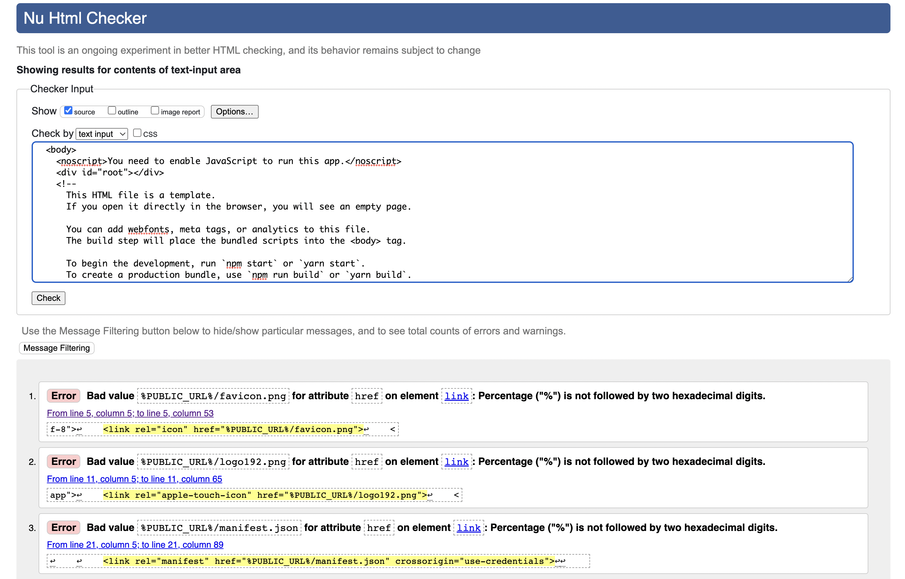
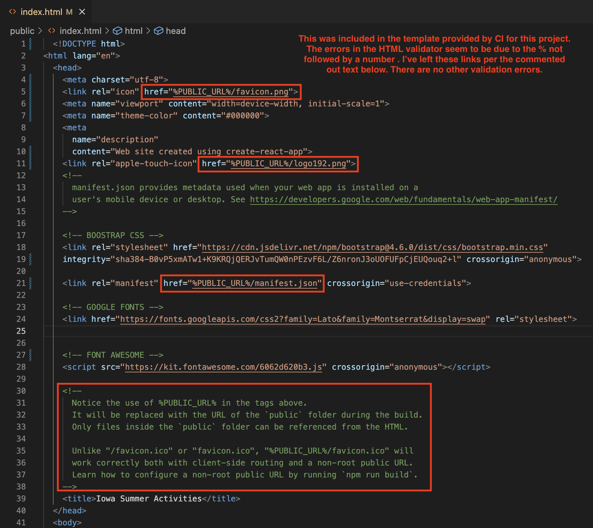
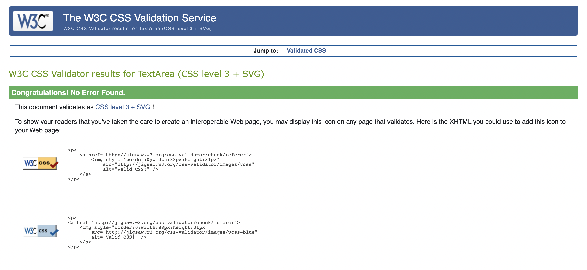
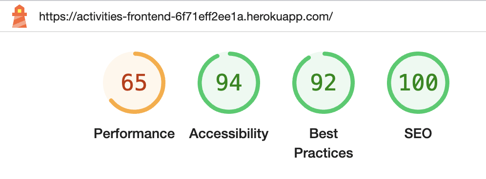
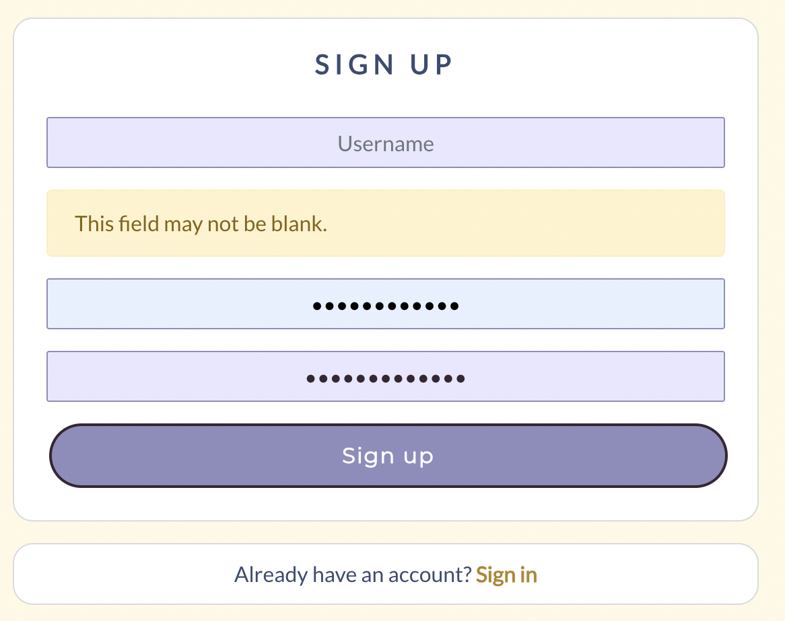
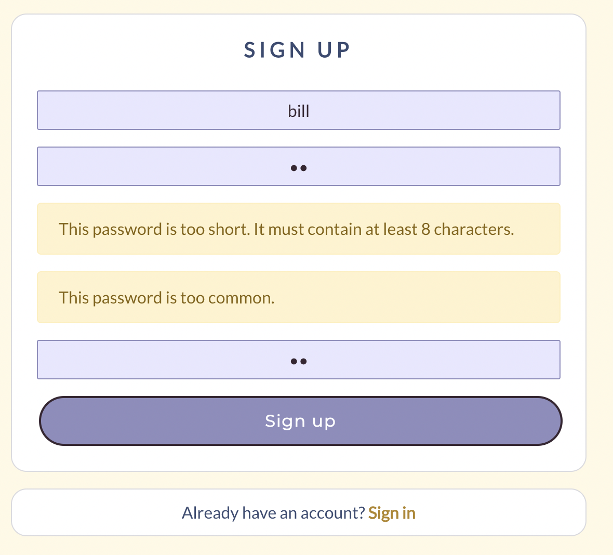
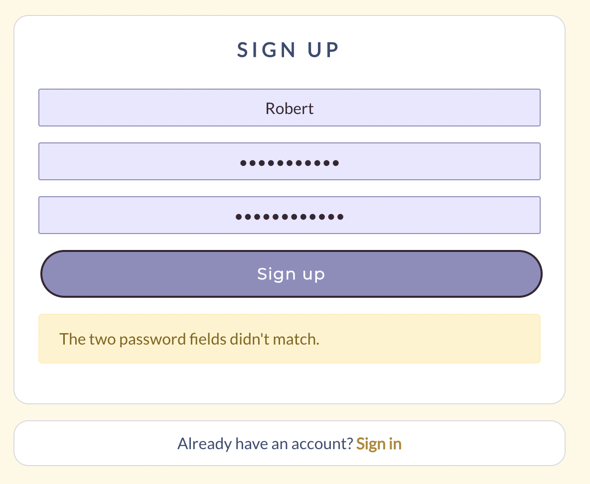

Return to [README](README.md)

# **Iowa Summer Activities**

# Frontend Testing

## Table of Contents

* [**Testing**](<#testing>)
    * [Code Validation](<#code-validation>)
    * [Lighthouse Testing](<#lighthouse-testing>)
    * [Manual Testing](<#manual-testing>)
    * [Peer Review](<#peer-review>)
    * [Known Bugs](<#known-bugs>)

## Code Validation
### HTML, CSS and JavaScript validation
HTML validation was done using the [W3C HTML Validator](https://validator.w3.org/). An error was found three times in the document: 'Percentage ("%") is not followed by two hexadecimal digits'. Please see the screenshot below along with a justification of the error.

HTML Score

Validation score

Error justification

  

CSS files were validated through the [Jigsaw validator](https://jigsaw.w3.org/css-validator/). Any minor errors found on the pages were fixed and sent through the validator again. Ultimately, all pages passed with no errors.

CSS Score

  

JavaScript files were manually validated and errors resolved throughout the development process through feedback from the gitpod terminal. 

Files were also manually run through [JS Hint](https://jshint.com/). Though no errors were found, a few 'warnings' were present on various pages. These were largely in relation to the version of ES used:

- Unclosed regular expression.
- 'Async functions' is only available in ES8 (use 'esversion: 8').
- 'Object spread property' is only available in ES9 (use 'esversion: 9').
- 'Optional chaining' is only available in ES11 (use 'esversion: 11').

### Lighthouse Testing

Lighthouse testing was performed through the Google Chrome Developer Tools was used to test the application's *Performance*, *Accessibility*, *Best Practices* and *SEO* as a logged-in user on a desktop device. 

The performace score was rather poor, due to the inclusion of images for avatars, posted events and in other areas. This score could be improved in future iterations by compressing the images before uploading them.

Lighthouse Score

  

## Manual Testing
### Sign up
- The sign up page includes a form for registering as a user with Iowa Summer Activities.
- Filling out a valid form (including username and password) posts the data to the API and creates a new user.
- Filling out a valid form redirects the user to the Sign in page.
- Filling out an invalid form notifies the user what changes they need to make, which can be: leaving a field blank, too short or too common a password or passwords not matching.
        
        
        

- The form is fully responsive on various screen sizes.
- At the bottom of the form, there is a sentence and link to the sign in form, should the user have come to the sign up page erroneously. Clicking that link will redirect them to the sign in page.

<!--### Sign in
- Page features a form for signing in to Garden Diaries.
- Filling out a valid forms let the user sign in and redirects the user to the home page with a signed in view.
- Filling out an invalid form notifies the user what changes they need to make.
- The form is fully responsive to different screen sizes.
- The form features a link to the sign up page, redirecting users to the sign up page. 

### Navigation Bar

### Non authorized user
- The navbar features links to the Sign in and Sign up pages.
- The links redirect the user to the chosen page.
- The navbar is responsive and collapses to a burger menu on smaller screens. 

### Authorized user
- When the user is signed in, the navbar features links to `Add a diary entry`, `Shoppinglist`, `To-do list`, `My plants`, `Following`, `Liked entries` and `Sign out`, as well as the users avatar profile image and username, linking to the users profile page.
- All links redirect the user to the chosen page. 
- The navbar is responsive and collapses to a burger menu on smaller screens. 

## Home page 

### Popular profiles
- Avatar and username of users with the most followers are displayed on the home page, followed page, liked entries page and profile page.
- A `Follow`/`Unfollow` button is displayed next to the avatar and username, to signed in users.
- The `Follow`/`Unfollow` button is hidden from non authorized users.
- When clicked, the `Follow`/`Unfollow` button changes dynamically.
- When clicked, the `Follow`/`Unfollow` button updates the follow and following count of both users. 
- The component collapse and display the mobile version on smaller screens. 

### Post feed
- Diary posts made by all users are displayed on the home page, sorted by latest creation date. 
- The feed features infinite scrolling, letting the user continue to scroll through content as long as there is any. 

## Add a diary entry
- The user can access the form to post a diary entry through the link in the navbar.
- The form features image upload functionality. The image upload field lets the user upload an image.
- When an image have been added the the image upload field a button is displayed, letting the user reupload a different image if they want to change it.
- The Title field lets the user add a title to the post.
- The Notes field lets the user add a text to the post.
- The form feature a post and cancel button.
- When the Post button is clicked the form is submitted and the data saved to the api backend. 
- When the Cancel button is clicked the user is redirected to the previous page.

## Edit a diary entry 
- When clicking the edit icon in the post page dropdown menu the user is redirected to the post edit page.
- The form is prepopulated with the data from the original post.
- The form lets the user upload a different image. 
- The form lets the user edit the title and text fields.
- The edit form feature a save updates and cancel button.
- When submitted by clicking the save updated button, the post data is sent to the backend API and updated.
- When clicking the cancel button the user is redirected back to the post page. 

## Profile
- The user can access their own profile by clicking on their own avatar or username in the navbar, or wherever it's displayed on the website.
- Users can access other users profile by clicking on the avatar or username in the navbar, or wherever it's displayed on the website.
- The profile page display the amount of followers, following and posts.
- The profile page display a dropdown menu, redirecting the user to the username edit, password edit or profile edit page, accessible to the profile owner. 
- The profile page display all the posts by the user, sorted by latest created at the top. 
- The profile post feed features infinite scrolling, letting the user continue to scroll through content as long as there is any.

## Edit profile
- The profile page display a dropdown menu, redirecting the user to the username edit, password edit or profile edit page, accessible to the profile owner.
- The Edit profile link redirects the user to the edit profile form, where the user can update their bio and upload a profile image.
    - Submitting the bio and image form the data is sent and updated in the API.
    - Clicking the cancel button redirects the user back to the previous page.
- The Change username link redirects the user to the edit username form, prepopulated with the users username. 
    - Empty edit username form can't be submitted.
    - User can't change to a username that already exist, and are notified if they try to submit an invalid form.
    - Clicking the cancel button redirects the user back to the previous page.
- The change password link redirects the user to the edit password form.
    - Empty edit password form can't be submitted.
    - User cant submit an invalid password, and is notified with a message if they try. 
    - Clicking the cancel button redirects the user back to the previous page.
    
## Searchbar
- A searchbar is featured on the home page, `Shoppinglist`, `To-do list`, `My plants`, `Following`, `Liked entries` and `Profile page`.
- The searchbar on each page lets the user query for posts relevant to the specific page.
- If no matching query is found the page displays a message and image from the Asset component to inform the user of this. 

## Commentfield
- The post detail page feature a commentfield. 
- The commentfield feature a submit button. 
- When submitted the new comment is saved to the backend API and displayed underneath the commentfield. 
- Empty commentfields can not be submitted.
- When a comment is posted the comment count on the post is increased.
- When a comment is deleted the comment count on the post is decreased.
- When posted, owner can access the dropdown menu to edit or delete a comment.
- When the delete icon is clicked the comment post is deleted both on the website and in the database.
- When the edit icon is clicked the comment edit field is displayed, prepopulated with the comment text. 
- When the edit field is submitted, the post is updated and saved to the API.
- When the cancel button in the edit field is clicked the comment edit field is closed and no changes are made to the API data.

## Following
- Diary posts made by users that are followed by the signed in user displayed on the Followed page, sorted by latest creation date. 
- The feed features infinite scrolling, letting the user continue to scroll through content as long as there is any.
- A `Follow`/`Unfollow` button is displayed next to the avatar and username on the profile page and in the popular profiles component, available to signed in users.
- The `Follow`/`Unfollow` button is hidden from non authorized users.
- When clicked, the `Follow`/`Unfollow` button changes dynamically.
- When clicked, the `Follow`/`Unfollow` button updates the follow and following count of both users.

## Liked entries
- Diary posts liked by the signed in user is displayed on the Liked entries page, sorted by latest creation date.
- The feed features infinite scrolling, letting the user continue to scroll through content as long as there is any.
- If the user unlikes a post it is removed from the Liked entries page.

## Asset component
- The asset spinner is displaying when loading data from the API on all pages where it's been imported.
- The asset message is displaying as expected on all pages where it's been imported.
- The asset image is displaying as expected on all pages where it's been imported.

## Hooks

### Use click outside hook
- The use click outside hook let the user close the navbar hamburger menu when clicking outside of it. 

### Use redirect hook
- The use redirect hook redirects the user as expected where used.

## Peer Review
I personally tested this application in Chrome, Safari and Firefox on laptop and mobile devices. The website worked well with no issues that I noted. 

Additionally, I had peers and family members, both within the tech community and outside of it, text the website for useability. Their response was positive and they found no issues with the platform.

<!-- ## Known Bugs

Discuss bugs -->