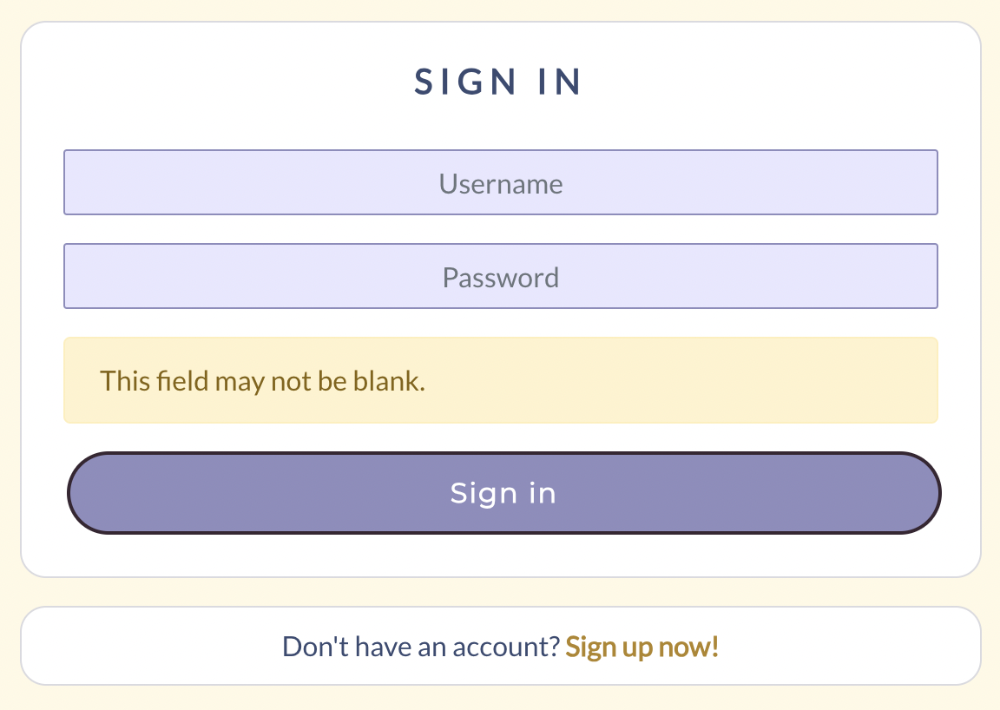
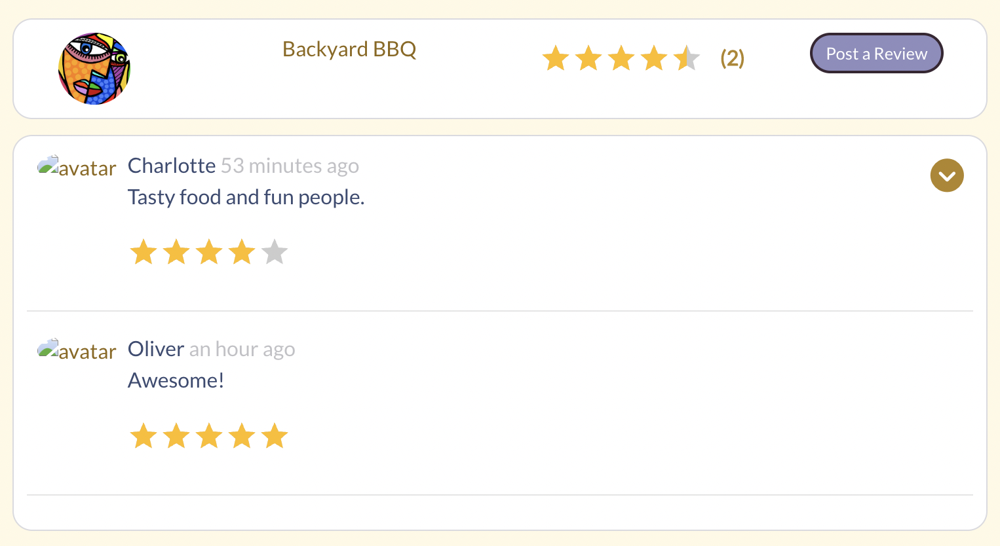
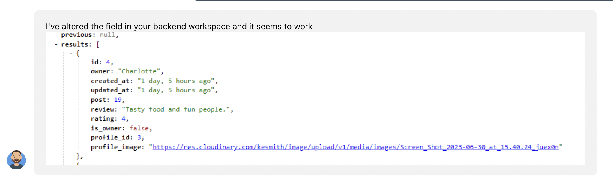

Return to [README](README.md)

# **Iowa Summer Activities**

# Frontend Testing

## Table of Contents

* [**Testing**](<#testing>)
    * [Code Validation](<#code-validation>)
    * [Lighthouse Testing](<#lighthouse-testing>)
    * [Manual Testing](<#manual-testing>)
    * [Peer Review](<#peer-review>)
    * [Known Bugs](<#known-bugs>)

## Code Validation
### HTML, CSS and JavaScript validation
HTML validation was done using the [W3C HTML Validator](https://validator.w3.org/). An error was found three times in the document: 'Percentage ("%") is not followed by two hexadecimal digits'. Please see the screenshot below along with a justification of the error.

HTML Score

Validation score

Error justification

  

CSS files were validated through the [Jigsaw validator](https://jigsaw.w3.org/css-validator/). Any minor errors found on the pages were fixed and sent through the validator again. Ultimately, all pages passed with no errors.

CSS Score

  

JavaScript files were manually validated and errors resolved throughout the development process through feedback from the gitpod terminal. 

Files were also manually run through [JS Hint](https://jshint.com/). Though no errors were found, a few 'warnings' were present on various pages. These were largely in relation to the version of ES used:

- Unclosed regular expression.
- 'Async functions' is only available in ES8 (use 'esversion: 8').
- 'Object spread property' is only available in ES9 (use 'esversion: 9').
- 'Optional chaining' is only available in ES11 (use 'esversion: 11').

### Lighthouse Testing

Lighthouse testing was performed through the Google Chrome Developer Tools was used to test the application's *Performance*, *Accessibility*, *Best Practices* and *SEO* as a logged-in user on a desktop device. 

The performace score was rather poor, I believe due to the inclusion of images for avatars, posted events and in other areas. This score could be improved in future iterations by compressing the images before uploading them.

Lighthouse Score

  

## Manual Testing
### Sign up
- The sign up page includes a form for registering as a user with Iowa Summer Activities.
- Filling out a valid form (including username and password) posts the data to the API and creates a new user.
- Filling out a valid form redirects the user to the Sign in page.
- Filling out an invalid form notifies the user what changes they need to make, which can be: leaving a field blank, too short or too common a password or passwords not matching.
        
        
        

- The form is fully responsive on various screen sizes.
- At the bottom of the form, there is a sentence and link to the sign in form, should the user have come to the sign up page erroneously. Clicking that link will redirect them to the sign in page.

### Sign in
- The page displays a simple form where a previously registered user can log into their Iowa Summer Activities account.
- Filling out a valid forms will allow the user to access the website, where they will be redirected to the homepage.
- Filling out an invalid form alerts the user of the changes they need to make:
    - Credentials don't match
    
    - Field(s) left blank
    
- The form is fully responsive on various screen sizes and includes an image on larger sizes. On smaller devices, the image disappears.
- A link at the bottom allows users to be redirected to the sign up page if they don't have an existing account.

### Navigation Bar
### Non-registered and non logged-in users
- The navbar is shown with links to the homepage, sign up and sign in pages.
- All three links redirect the user to the appropriate page, while clicking the site logo redirects them to the homepage.
- The navbar is responsive and collapses into a hamburger dropdown menu on smaller device screens.

### Registered and logged-in users
- When the user is logged into their account, the navigation bar includes the pages: 'Create an Event', 'Feed', 'Liked', 'Contact DSM', 'Reviews', 'Sign out' and 'Profile'. 
- The profile page includes the user's avatar image (or a default image). Clicking the avatar image will redirect the user to their profile page.
- All links in the navigation have been tested and properly redirect the user to the appropriate page. 
- The navbar is responsive and collapses into a hamburger dropdown menu on smaller device screens.

## Homepage 
## Create an Event
- By clicking the 'Create an event' icon next to the site logo, the user can access the form to create an event. This link is present in the navbar on all pages. On smaller device screens it appears alone between the site icon and the hamburger dropdown menu.
- The form features three fields: a mandatory title, an optional description and a mandatory image upload. Not filling out one of the mandatory fields will alert the user or an error and ask them to rectify it. 
- Once an image has been loaded, a 'change the image' button will appear, allowing the user to click and select a different image to display.
- Once the 'create' button is clicked, the form is submitted, the data is saved to the backend API and the event appears on the frontend website.
- Clicking the cancel button will send no information to the backend API and the user will be redirected to page they were previously on.

## Edit an event
- Users can edit only events they've created.
- The form is pre-populated with the information from the original post.
- The user can choose to change the title, description and/or image. The image section is optional, while the other two fields are mandatory.
- When the 'save' button is clicked, the information is updated, both in the backend API and on the frontend website.
- Clicking the cancel button will send no information to the backend API and the user will be redirected to page they were previously on.

## Liked
- Clicking the heart icon on an event will color the heart red and the number of 'likes' will increase by one, both in the backend API and on the frontend website.
- Users cannot 'like' posts for which they are the authors.
- Clicking the filled-in red heart for a post a user has 'liked' will 'unlike' that post and subtract one number from the number of likes that post has, both in the backend API and the frontend website.

## Contact
- All fields of the contact page are mandatory. Leaving any field blank will result in an error message for the user.
- The email field requires a valid email address (eg: including an @ symbol)
- If the user intends to send the contact form with any fields blank or invalid, an error message will be shown.
- Once successfully sent, a message will be displayed to the user thanking them for their correspondence. This message does not go to any real email account and is only visible from the backend 'Contact' section as a logged in admin superuser.
- There is no way to 'unsend' a contact message. 

## Reviews 
- Users cannot review events for which they are the owner.
- Users cannot review events more than once.
- Users can edit their review comment and save that information. To change the star-review, they will have to delete their review entirely and start again.

## Profile
- The user can access their own profile by clicking their avatar image or 'Profile' in the navbar or wherever the avatar is shown on the website. 
- Users can see others' profile pages by clicking their avatars. Doing this will take the user to the other person's page where you can see all events they've created.
- The profile page shows the number of posts created, followers and users following.
- A user's own profile includes an arrow dropdown menu that has clickable icons to edit the profile, change the username or the password and, if clicked, will redirect the user to these pages.
- The profile page includes an 'infinite scroll' feature which will allow the user to scroll through content as long as there is any.

## Edit profile
- Once the user is on their profile page, clickng the arrow dropdown menu will allow them to select to edit their profile or change their username or password. This page is accessible only to each owner, meaning a user cannot edit another users information, barring admin superusers from the backend. There is one superuser created for this site.
- Clicking the edit profile link redirects the user to edit their own profile. There they can change the avatar image and their short bio. Save this information will save the changes to the backend API and to the frontend website. Cancelling these changes will redirect the user to the page they were previously on. 
- Clicking to change the username redirects the user to that page where they will choose a different username that will appear, both in the backend API and on the frontend website page to other users. Clicking the cancel button will return them to the page they were previously on. Empty unsername fields cannot be saved on the form nor can a user choose a username that already exists. 
- Clicking to change the password redirects the user to be able to edit their password information. Like the username change form, empty fields cannot be submitted, nor can users choose an invalid password. Clicking 'cancel' redirects them to the page they were previously on.

## Most Followed Profiles
- The 'Most Followed Profiles' section is always displayed, regardless of the user's login status. The 'follow / unfollow' buttons are present only for logged-in users and only on larger screens. To (un)follow a user on a smaller device, a logged-in user must click the other user's profile avatar.
- The avatar and username of each user with the most followers are displayed on the home, feed, liked, reviews and profile pages.
- A 'Follow' button is displayed next to each avatar, barring the user's own avatar, should they fall within the 'most followed profiles' category. The follow button, once clicked, will change to an 'Unfollow' option if the user wants to unfollow another.  
- When clicked, the 'Follow / Unfollow' button updates the follow and following count of both users and changes color.
- The component collapse and display the mobile version on smaller screens. 

## Asset Component
- The asset spinner displayes when data is loading on the frontend website from the backend API on all pages it's been imported on. 

## Hooks

### Use Click Outside Toggle
- Hook that allows the user to close the hamburger navbar by clicking anywhere outside of it.

### Use Redirect
- Hook that redirects the user to the appropriate page where this hook is implemented. 

## Peer Review
I personally tested this application in Chrome, Safari and Firefox on laptop and mobile devices. The website worked well with no issues that I noted. 

Additionally, I had peers and family members, both within the tech community and outside of it, text the website for useability. Their response was positive and they found no issues with the platform.
 
## Identified Bugs
## Solved
- BUG: The 'Back to Top' feature was giving an error, but only on some occasions. It seemed irrelevant whether the user was logged in or not. Given that I realized this bug at the end of development and was unable to fix the error in my code properly, I chose to remove the feature entirely for this deployment. Given that it doesn't affect the functionaly of my application, I thought this was the best decision. 

    - FIX:  Remove the code for this feature entirely. Now there is no error.

###
- BUG: The correct avatar image does not appear when editing a review. The image is an error, as if it didn't exist.

    - FIX: I went to tutoring for help on this. Jason was helpful in working through the code with me, identifying exactly _where_ my variables were coming from and _what_ I was calling them. In the end, it was my serializers.py file that had a typo (profile_profile_image, rather than profile_image). Once this was corrected and redeployed, everything worked well. 
        

Bug and fix images

        
        
        
        
  

###
- BUG: I was unable to properly delete a review. I solved this by following, almost to the letter, the same logic I used for the 'delete comment' section. This worked.

    - FIX: Follow same logic as the 'delete comment' section and adapt it to the reviews section.

###
- BUG: I was able to post more than one review. 

    - FIX: I spoke with tutoring again for the solution to this issue. I had inadvertently put my code into the post serializer rather than the review serializer. Given that I was reviewing a post, I thought this was appropriate. Tutoring helped me realize my mistake in logic and helped solve the problem by defining the variable properly. 

## Unsolved
- BUG: If a user reviews an event the page doesn't automatically refresh. If the user clicks to review the same event again, a new review form will pop up. They can fill it out but won't be able to post it. Ideally, the user should be unable to click this button again and see the form for a second time for the same event if they've already posted a review. This is the case if the page is refreshed.

- BUG: This website was tested on various browsers, Safari being one of them. However, this application does not work properly on Safari. Users are able to scroll through events on the homepage as unregistered, logged-out users but once they attempt to create a user or log into their account, the page refreshes and they're redirected to the sign in page. If they choose to create a new user, the same happens, they're retunred to the sign up page, though a user has been created (seen from the admin superuser from the backend and on the frontend for other users able to log in). If this application reaches real-world use, this will of course be something to address, given the multitude of Apple users.

- BUG: This application works well on various browsers and was built using Chrome exclusively. However, during the testing process, I tried to log into my account through the Chrome 'incognito' window and was unable to. The result is the same as is mentioned above with Safari.
    

Chrome incognito bug

    
    
 

